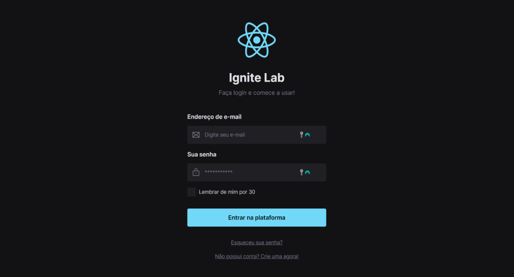
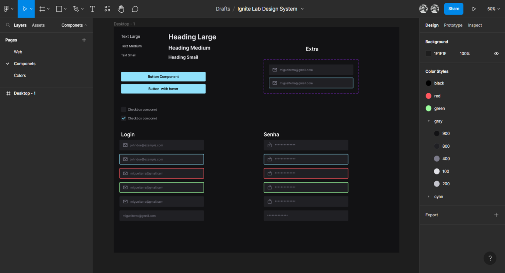
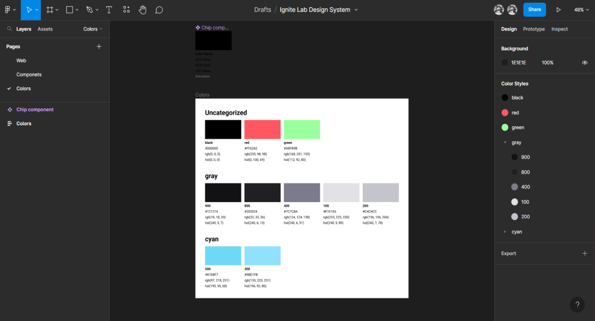

# Ignite Lab

Foi desenvolvido o Design System da aplicação com Figma | Storybook.

## Tecnologias utilizadas

- [Storybook](https://storybook.js.org)
- [React](https://reactjs.org)
- [Vite](https://vitejs.dev)
- [Tailwind](https://tailwindcss.com)
- [Radix UI](https://www.radix-ui.com)
- [Postcss](https://postcss.org)